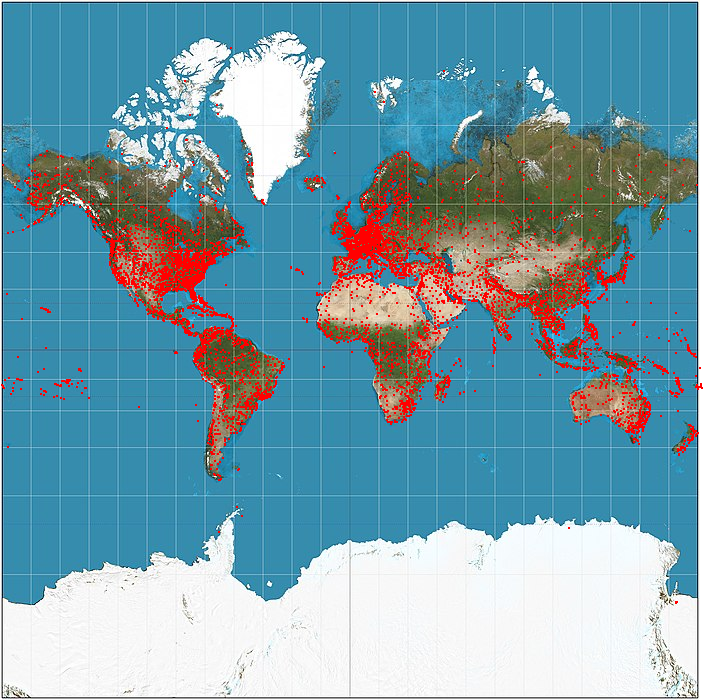

# Written Report
Our team wrote a program that examines the OpenFlights dataset and determines the betweenness centrality by mapping the most significant airports.

## Output and Correctness
We used an edge-weighted directed graph to store our data. In order to test if our graph was being read and implemented correctly, we tested:
- Reading files
- Constructing the graph (Vertices and adjacencies)

We also created a visualization of the map of airports, however the map can only contain 95% of the airports in our official dataset.

### Algorithms
- Breadth-First Search (BFS)
  Our BFS algorithm does work correctly. This algorithm was relatively short, as we used a queue and a map in order to efficiently record the traversal.

  Here is a visualizer showing that our BFS is working: https://drive.google.com/file/d/1aTbAXNnJ0q6unTS_taaLd77rPeAcxQX6/view?usp=sharing.
  We used color-coded nodes to indicate the states of the function:
  - Green is recently added
  - Red is recently removed
  - Blue is nodes remaining

  To test BFS, we took sample data of airports and routes to create a smaller graph. Then we check to see if our BFS steps are correct and if the total path is correct.
  
- Shortest path using Dijkstra's algorithm

  We first planned to use Johnson's algorithm, but then decided to use two versions of Dijkstra's algorithm: One to calculate a singular shortest path given a source and destination and another to calculate all shortest paths to help with calculating the betweenness centrality. We used a vector for the former to store the path between two airports. For calculating all shortest paths, we used a priority queue to make the runtime faster, as we are parsing through multiple datasets at a time.

  We tested multiple instances of graphs to check if this algorithm worked, including:
  - 4-vertex graph: tested if the path is correct
  - 5-vertex graph: tested if the path is correct
  - 6-vertex graph: tested if the path is correct, also tested if the shortest distance is recorded correctly and if the "steps" are recorded correctly
  
- Brande's algorithm for betweenness centrality

  Our implementation of Brande's algorithm does output the expected values, however the runtime of this algorithm is slower than our expected runtime of O(|V|^2log(|V|) + |V||E|) because we have so many data points in our official datasets.
  
  We tested our betweenness centrality implementation by taking a 6-vertex graph and checking if the output of the function given a vertex matches our expected answers. As it did pass our tests within a reasonable amount of time, it was only because we used such a small dataset.

## Leading Question
  We wanted to find out which airport was the most important or had the most flight connections. In order to find that out, we wanted to create a program that determines the betweenness centrality of all the airports in the world. We used airport and route data to determine shortest paths between airports and ultimately the betweenness centralities of the airports.

  However, it was difficult to determine which airport is the most important because of how large our dataset is. There are over 14,000 airports and over 100,000 routes, and it would be difficult and memory-heavy to parse through all airports' betweenness centralities and find the airport with the most connections. We did run a test and we saw that Hamad International Airport had 151,564 routes connected. It may not be the most important airport, but it shows that our program works as intended. If we had more time we could try to find a way to make our betweenness centrality algorithm more efficient. We could also create a better visualization of our map, perhaps a bigger map showing connections between airports and a way to show the most visited or important airports. 
